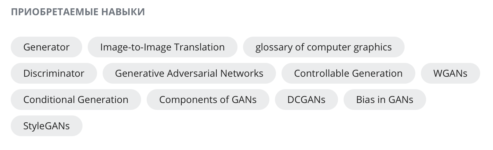

# Coursera_GANs
The DeepLearning.AI Generative Adversarial Networks (GANs) Specialization provides an exciting introduction to image generation with GANs, charting a path from foundational concepts to advanced techniques through an easy-to-understand approach. It also covers social implications, including bias in ML and the ways to detect it, privacy preservation, and more.

#[DeepLearning.AI Generative Adversarial Networks (GANs) Specialization](https://www.coursera.org/specializations/generative-adversarial-networks-gans)

## Course 1: [Build Basic Generative Adversarial Networks (GANs)](https://www.coursera.org/learn/build-basic-generative-adversarial-networks-gans?specialization=generative-adversarial-networks-gans)
- Week 1: Intro to GANs
- Week 2: Deep Convolutional GANs
- Week 3: Wasserstein GANs with Gradient Penalty
- Week 4: Conditional GAN & Controllable Generation

## Course 2: [Build Better Generative Adversarial Networks (GANs)](https://www.coursera.org/learn/build-better-generative-adversarial-networks-gans?specialization=generative-adversarial-networks-gans)
- Week 1: Evaluation of GANs
- Week 2: GAN Disadvantages and Bias
- Week 3: StyleGAN and Advancements

## Course 3: [Apply Generative Adversarial Networks (GANs)](https://www.coursera.org/learn/apply-generative-adversarial-networks-gans?specialization=generative-adversarial-networks-gans)
- Week 1: GANs for Data Augmentation and Privacy
- Week 2: Image-to-Image Translation with Pix2Pix
- Week 3: Unpaired Translation with CycleGAN

